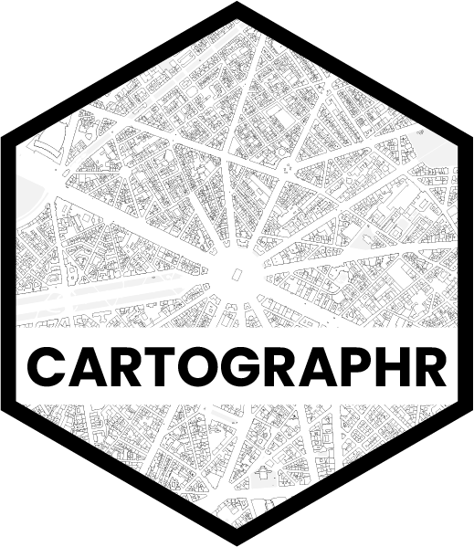

---
output:
  md_document:
    variant: gfm
---

<!-- README.md is generated from README.Rmd. Please edit that file -->

```{r, echo = FALSE}
knitr::opts_chunk$set(
  collapse = TRUE,
  comment = "#>",
  fig.path = "man/figures/",
  warning = FALSE
)
```

# cartographr <a href='https://da-wi.github.io/cartographr'></a>

[](https://github.com/da-wi/cartographr/actions/workflows/R-CMD-check.yaml)
[](https://app.codecov.io/gh/da-wi/cartographr?branch=develop)

## Overview

Creating maps from OpenStreetMap data can be a complex and time-consuming process. The syntax for designing maps often lacks intuitiveness and can vary greatly, making it challenging for users to produce visually appealing, print-ready maps. Additionally, overlaying additional information layers while maintaining cartographic aesthetics requires a deep understanding of spatial data, which can detract from the storytelling aspect of map creation. `cartographr` addresses these issues by providing a lightweight and user-friendly interface between `osmdata` and `ggplot2`, streamlining the map-making process and allowing users to concentrate on the narrative conveyed by their maps. It offers a practical and adaptable solution for transforming geospatial data using simple features (`sf`) geometries into informative, high-quality visualizations, thereby improving the dissemination of spatial information. Whether you’re involved in urban planning, environmental studies, or need to create impactful public presentations, `cartographr` is designed to make your work as straightforward and effective as possible. 

## Installation

Simply install from github.

```{r eval=FALSE}
devtools::install_github("da-wi/cartographr")
```

## Usage

```{r eval=FALSE}
get_osmdata(lat = 53.543, lon = 10.000, x_distance = 1000) |> plot_map()
```

For a step-by-step guide of the package’s basic features, please refer to the [introductory vignette](https://da-wi.github.io/cartographr/articles/cartographr.html).

## Data licensing
All data that you access using `cartographr` and, in consequence, `osmdata` is licensed under OpenStreetMap’s license, the <a href="https://wiki.osmfoundation.org/wiki/Licence">Open Database Licence</a>. Any derived data and products must also carry the same licence. You should make sure you understand that licence before publishing any derived datasets.

## Getting help
If you encounter a clear bug, please file an issue with a minimal reproducible example on <a href="https://github.com/da-wi/cartographr/issues">GitHub</a>.

## Credits

The development of this project drew inspiration from the [prettymaps](https://github.com/marceloprates/prettymaps) project.
