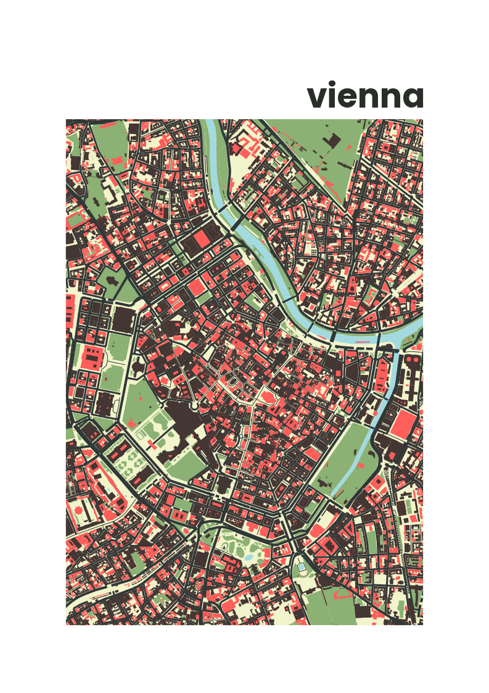

# cartographr

Make beautiful maps based on OSM in R

## Installation

Simply install from github.

```
devtools::install_github("da-wi/cartographr",upgrade = "never",INSTALL_opts=c("--no-multiarch") )
library(cartographr)
```

## Getting stared

Try to create a beautiful poster.

1. Define the coordinates of the center, as well as the extend of the map in meters. 

``` 
df.vienna <- tibble(lat = c(48.210),
                    lon = c(16.371),
                    y_distance = c(1200*sqrt(2)),
                    x_distance = c(1200),
                    name = c("vienna"))
```

Next, we retrieve the osm data with `get_osmdata()` and clean the osm object using the `preprocess_map()` function. As this package is optimized for printing, the preprocessing step already includes the preferred output size.

```
osm <- get_osmdata(df.vienna$lat, df.vienna$lon, df.vienna$y_distance,df.vienna$x_distance) |>
  preprocess_map(circle = F)
```

After cleaning the osm object from unwanted props, the map can be created using `plot_map()`. We use `theme_postcard()` as theme for the map, and tell the theme the preferred output size to adjust size of fonts, linewidths, etc. 

```
plot.vienna <- osm |> plot_map(theme = get_theme("barcelona"),scaling = get_scaling("A4")) +
  theme_postcard(get_scaling("A4")) +
  labs(title="vienna")

plot.vienna
```


Lastly, we can save the map ready-to-print as pdf using `save_map()`. 

```
save_map(plot = plot.vienna, filename=paste0("~/vienna_a4.pdf"))
```

If you prefer a bitmap format, you can also directly call `ggsave()` from the `ggplot2()` package. 

```
ggsave(paste0("~/vienna_a4.png"),
       plot = plot.vienna,
       bg = "white",
       device = "png",
       dpi = 96,
       width = 210,
       height = 297,
       units = "mm")
```

