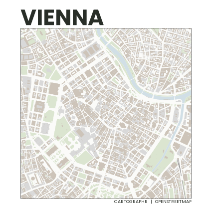

```{r, include = FALSE}
library(cartographr)
knitr::opts_chunk$set(
  echo=TRUE,
  message=FALSE,
  warning=FALSE,
  collapse = TRUE,
  comment = "#>"
)
```

In this vignette, you will learn how to use the package functions step-by-step.

*Step 1:* Begin by determining the central point of your map using the [WGS84](https://de.wikipedia.org/wiki/World_Geodetic_System_1984) coordinates. For our example, we’ll use Vienna’s center with a latitude of `48.210` and a longitude of `16.370`. You can easily find these coordinates online.

*Step 2:* Decide on the size of the printed map, such as A4. This will help scale the text and lines on the map proportionally, no matter the print size.

```{r eval=FALSE}
set_output_size(c(300,300))
```

*Step 3:* Use the `get_osmdata()` function to collect OpenStreetMap data. Set the width of your map area in meters using the `x_distance` parameter. If you leave out the height (`y_distance`), it will be calculated based on the width and the aspect ratio of your chosen output size.


```{r eval=FALSE}
osm <- get_osmdata(48.210, 16.370, x_distance = 1200)
```

*Step 4:* The `osm` variable now contains all the geometric shapes (like buildings, rivers, parks) that will appear on your map. Generate the map with `plot_map()` and customize its look with themes and color palettes. For instance, create an infomap of Vienna using `theme_infomap()` and choose a color scheme (see `get_palette()`).

```{r eval=FALSE}
plot_vienna <- osm |> plot_map(palette = "serene") +
  theme_infomap() +
  ggplot2::labs(title = "VIENNA")
```

*Step 5:* To view your map, simply call the print function.

```{r eval=FALSE}
plot_vienna
```


```{r eval=FALSE, include  = FALSE}
ggsave(plot_vienna + theme(plot.title = element_text(size = 60)), filename = "png/vienna.png", device = "png",width = 300,height = 300, units = "mm", dpi = 96, bg = "white" )
```

```{r echo=FALSE,include=FALSE,fig.align='center', fig.cap='',fig.dim=c(2.5,2.5), out.width='70%'}
# 
```

*Step 6:* Finally, save your map as a PDF file, ready for printing.

```{r eval=FALSE}
save_map(plot = plot_vienna, filename="vienna.pdf")
```


